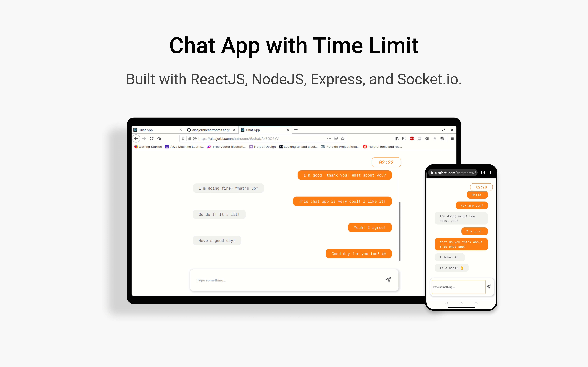

# Chat App with Time Limit

A real-time chat app that allows you to create private chat rooms that get destroyed after a time limit.
Built with ReactJS, NodeJS, Express, and Socket.io.

I built it because it looked like a challenge, and I learned a lot throughout the process.

### Try the app [here](https://alaajerbi.com/chatrooms) or clone the repo to run it locally.

## How it works?

When you click on the create chatroom button, the node server (deployed on a Heroku dyno instance) creates a room instance with a unique ID, adds it to the queue of all the other pending rooms, and sends it back to the client. Once two people join the room by navigating to the room link, a socket connection from the two clients to the server gets established, the room becomes "active" and the countdown timer starts ticking and the chat functionality is enabled. Once the time is up, the room gets automatically destroyed.

You can create more than one room and start them simultaneously, each will have its own countdown timer and will be destroyed when their time is up. However, only two users are allowed in a single room.

If you leave the chat room while it is still active or you refresh the page, the socket connection will be lost and the room will be destroyed. 

